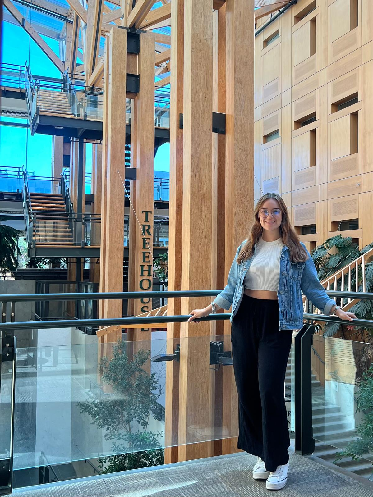

```{=html}
<section class="home-hero">

  <!-- Photo -->
  <div class="home-photo">
    
  </div>

  <!-- Text -->
  <div class="home-text">

    <p class="home-greeting">WELCOME</p>

    <h1 class="home-name"> I'm <em> Clarissa</em></h1>

    <div class="home-divider"></div>

    <p class="home-bio">
      I'm an environmental engineer currently pursuing a Master's in Geomatics at the University of British Columbia, a field where science meets storytelling.
      <br><br>
      Growing up in Sonora Mexico, the desert was my first teacher in resilience and adaptability, there I learned that even the quietest landscapes are rich in beauty and biodiversity. Curiosity and a deep appreciation for the environment have always been my North Star, shaping the way I see the world and the work I do today.
      <br><br>
      When I step away from my desk, I'm happiest on a trail, going for a swim, or chasing a new favorite viewpoint. When at home, you'll find me tending to my plants, arranging flowers, or trying out a new craft.
    </p>

    <!-- Navigation Cards -->
    <div class="home-cards">
      
       <a href="resume.html" class="home-card">
        <span class="card-icon">📄</span>
        <span class="card-label">Resume</span>
        <span class="card-desc">Experience & education</span>
      </a>

      <a href="projects.html" class="home-card">
        <span class="card-icon">🗺️</span>
        <span class="card-label">Interactive Projects</span>
        <span class="card-desc">Interactive maps & analyses</span>
      </a>

      <a href="work.html" class="home-card">
        <span class="card-icon">🖼️</span>
        <span class="card-label">Map Gallery</span>
        <span class="card-desc">Cartographic work</span>
      </a>

    
    </div>

    <!-- Social Links -->
    <div class="home-links">
      <a href="https://www.linkedin.com/in/clarissagutierrez0812/" target="_blank">LinkedIn</a>
      <span class="link-sep">·</span>
      <a href="https://github.com/cigm99" target="_blank">GitHub</a>
      <span class="link-sep">·</span>
      <a href="mailto:cigm99@gmail.com">Email</a>
    </div>

  </div>

</section>
```

\
