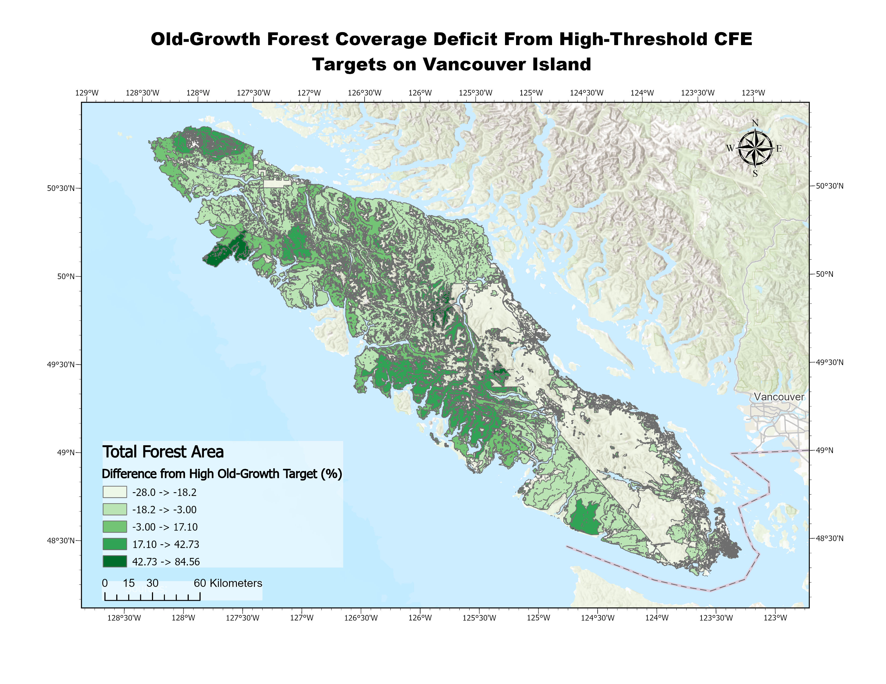
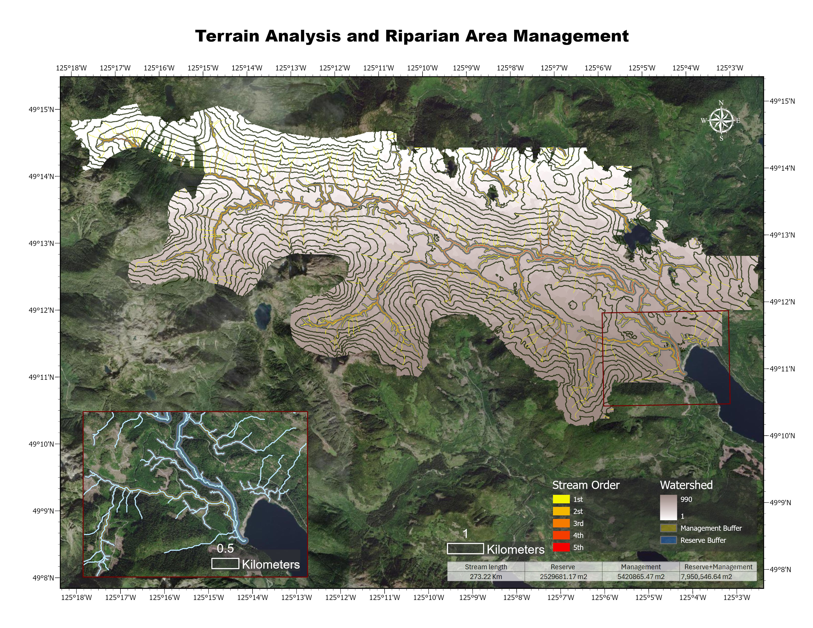
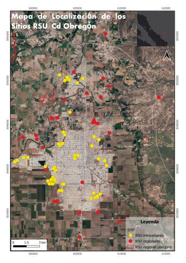

```{=html}
<!-- Lightbox overlay -->
<div class="lightbox-overlay" id="lightbox">
  <div class="lightbox-inner">
    <button class="lightbox-close">&#x2715;</button>
    
    <div class="lightbox-caption">
      <p class="lightbox-title" id="lightbox-title"></p>
      <p class="lightbox-desc" id="lightbox-desc"></p>
    </div>
  </div>
</div>

<!-- Gallery Grid -->
<div class="gallery-grid">

  <div class="gallery-item">
    
    <div class="gallery-hover">
      <p class="gallery-title">Grizzly Bear Habitat & Least Cost Path</p>
      <p class="gallery-desc">Raster analysis and least cost path modeling of Grizzly Bear movement in western Alberta.</p>
    </div>
  </div>

  <div class="gallery-item">
    
    <div class="gallery-hover">
      <p class="gallery-title">Old-Growth Forest Coverage Deficit</p>
      <p class="gallery-desc">Spatial analysis of old-growth shortfall from high-threshold CEF targets on Vancouver Island.</p>
    </div>
  </div>

  <div class="gallery-item">
    
    <div class="gallery-hover">
      <p class="gallery-title">Salmon Spawning Habitat Network</p>
      <p class="gallery-desc">Hydrologic network analysis and salmon spawning habitat identification on Vancouver Island.</p>
    </div>
  </div>

  <div class="gallery-item">
    
    <div class="gallery-hover">
      <p class="gallery-title">Identifying Illegal Urban Solid Waste Dumps</p>
      <p class="gallery-desc">Supervised classification and spectral signature analysis to map illegal waste sites in Cd. Obregon, Sonora.</p>
    </div>
  </div>

</div>

<script>
  document.querySelectorAll('.gallery-item').forEach(function(item) {
    item.addEventListener('click', function() {
      var src = this.querySelector('img').getAttribute('src');
      var title = this.querySelector('.gallery-title').textContent;
      var desc = this.querySelector('.gallery-desc').textContent;
      openLightbox(src, title, desc);
    });
  });

  function openLightbox(src, title, desc) {
    document.getElementById('lightbox-img').src = src;
    document.getElementById('lightbox-title').textContent = title;
    document.getElementById('lightbox-desc').textContent = desc;
    document.getElementById('lightbox').classList.add('active');
    document.body.style.overflow = 'hidden';
  }

  function closeLightbox() {
    document.getElementById('lightbox').classList.remove('active');
    document.body.style.overflow = '';
  }

  document.getElementById('lightbox').addEventListener('click', closeLightbox);
  document.querySelector('.lightbox-inner').addEventListener('click', function(e) {
    e.stopPropagation();
  });
  document.querySelector('.lightbox-close').addEventListener('click', closeLightbox);

  document.addEventListener('keydown', function(e) {
    if (e.key === 'Escape') closeLightbox();
  });
</script>
```
